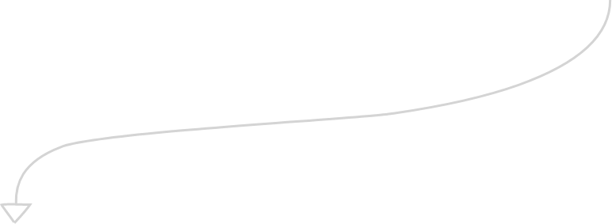

<h1 align="right"> Lia Laurindo </h1>

 
 Graduanda em Análise e Desenvolvimento de Sistemas
 e também me aplico aos estudos de programação para Back-End. 
 Fui aluna na Turma 16 de Back-End no Desenvolvimento Web da 
 Reprograma e atualmente faço parte da turma 61 de Pessoa
 Desenvolvedora FullStack Java da Generation Brasil.

  <a href="https://github.com/lialaurindo">  
 

 
  <h3 align="left"> <b><i> Somos o código do tempo </i></b></h3>

 ##

<h3 align="center"> <b><i> e além </i></b></h3>

 ##

  <h3 align="right"> <b><i> e ainda </i></b></h3>

 
